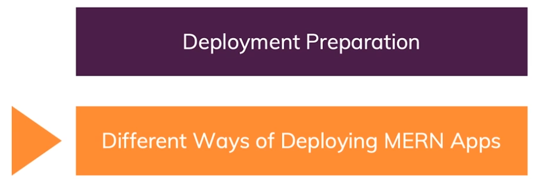
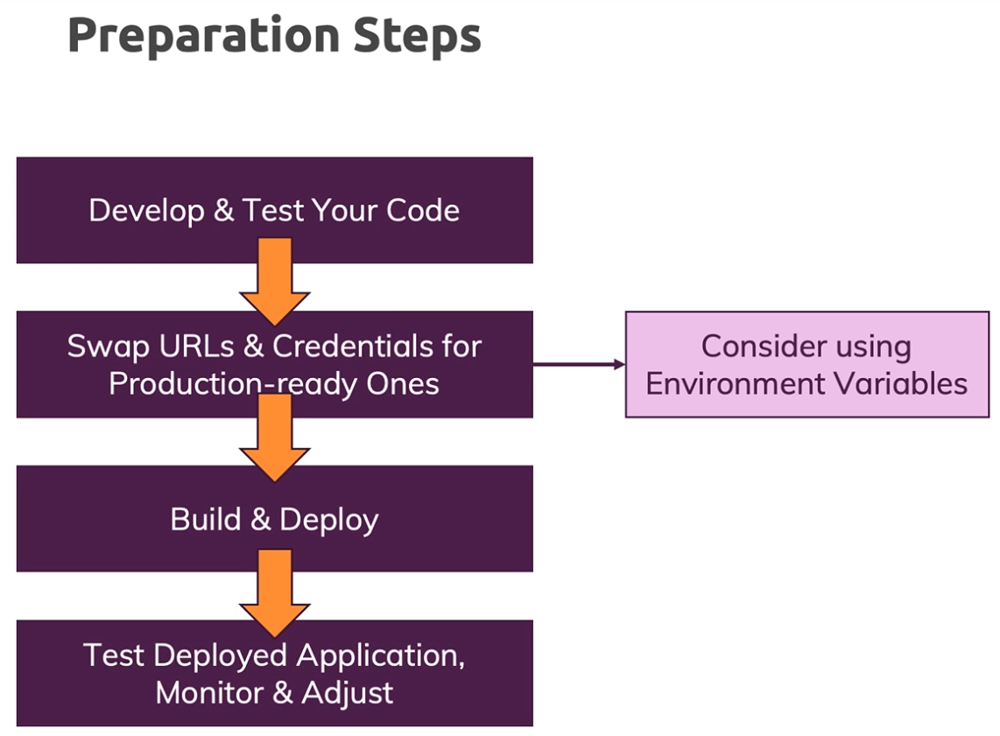

# APP_Practice_codes

## Section 소개


## 앱 배포 과정


## Deployment Preparation Steps


## MERN 앱 배포 방법


### 1. 두 개의 분리된 앱 배포
- **필요 서버**: 2개
  - **FrontEnd**: AWS S3, Firebase Hosting 등
  - **BackEnd**: AWS EC2/EB, Heroku 등
- **특징**: FrontEnd와 BackEnd 간의 통신을 위해 CORS 헤더가 필요

### 2. 하나의 통합된 앱 배포
- **필요 서버**: 1개
  - **사용 서버 예시**: AWS EC2/EB, Heroku 등
- **특징**: 동일한 도메인에서 동작하므로 CORS 헤더가 필요하지 않음

___

### 구성

- NodeJS -- Express -- React
- MVC 패턴 (model–view–controller, MVC)
- mongoose (mongoDB), (cloud Server DB : Atlas)
  - [MongoDB Atlas](https://cloud.mongodb.com/v2#/org/66fcba7d069a4d43c73cf7af/projects)
- 구글 MAP_API 사용
  - [Google Cloud Console](https://console.cloud.google.com/apis/credentials?hl=ko&project=effective-brook-437306-h0)
- FrontEnd 서버
  - ***AWS s3***
    - [awsS3] https://eu-north-1.console.aws.amazon.com/console/home?region=eu-north-1#
- BackEnd 서버
  - ***heroku***
    - [heroku] https://dashboard.heroku.com/

___

#### 
# BackEnd( JavaScript, NodeJS, ExpressJS ) 배포판 빌드
#### 

### 환경변수 설명
  - `.nodemoon` [개발전용]
  - `heroku 로그인 -> Settings -> Config Vars -> Reveal Config Vars` [배포전용]

### BackEnd code 배포판 빌드
```bash
X 필요 없음
```

### Local Test
```bash
$ npm install -g serve
$ serve -s build  # localhost:5000 으로 서버구성해서 build 디렉토리에 있는 코드 로컬실행
```

### Local Test ( with local backend )
```bash
$ nodemon app.js  # localhost:5000 으로 서버구성해서 app.js 실행 (build 디렉토리 X)
```

### 실행 에러 정리
```bash
# nodemon 없으면 설치 필요
$ npm install -g nodemon
$ nodemon -v
```

___

#### 
# BackEnd server 업로드
#### 

### heroku 업로드
  - Automatic deploys from ***본인 깃 Branch*** are enabled  설정 후, 
  - git push 하면 자동(CI/CD) 업로딩 진행

### heroku install
```bash
$ curl https://cli-assets.heroku.com/install-ubuntu.sh | sh
```

### heroku 사용 Command
```bash
# 뭐든 로그인 후 CLI 이용
$ heroku login
# Dyno 끄기
$ heroku ps:scale web=0 --app heroku-app-name
# Dyno 켜기
$ heroku ps:scale web=1 --app heroku-app-name
# 재시작
$ heroku restart --app heroku-app-name
# 애플리케이션 상태 확인
$ heroku ps --app heroku-app-name
# 각종 정보 확인
$ heroku info -a heroku-app-name
# 서버 로그 확인
$ heroku logs --tail --app heroku-app-name
# 환경 변수 설정
$ heroku config:set KEY=VALUE --app heroku-app-name
```