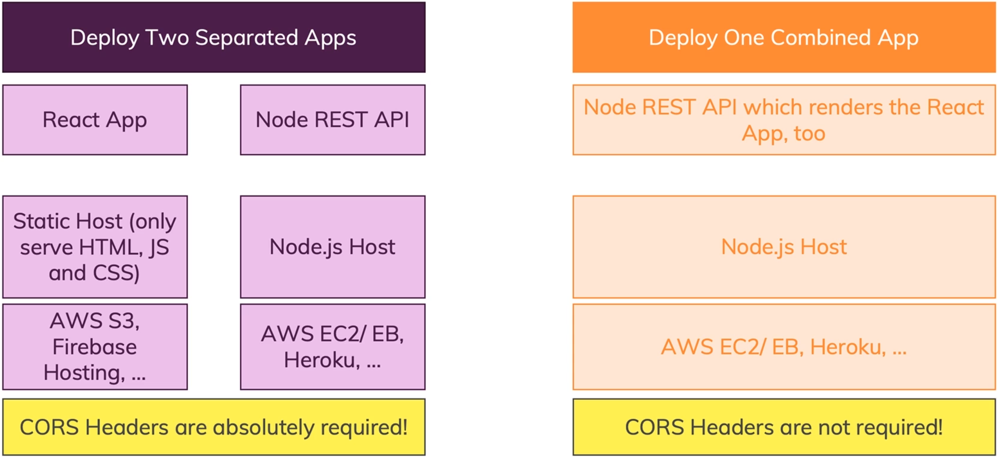

# APP_Practice_codes

## Section 소개


## 앱 배포 과정


## Deployment Preparation Steps


## MERN 앱 배포 방법


### 1. 두 개의 분리된 앱 배포
- **필요 서버**: 2개
  - **FrontEnd**: AWS S3, Firebase Hosting 등
  - **BackEnd**: AWS EC2/EB, Heroku 등
- **특징**: FrontEnd와 BackEnd 간의 통신을 위해 CORS 헤더가 필요

### 2. 하나의 통합된 앱 배포
- **필요 서버**: 1개
  - **사용 서버 예시**: AWS EC2/EB, Heroku 등
- **특징**: 동일한 도메인에서 동작하므로 CORS 헤더가 필요하지 않음

___

### 구성

- NodeJS -- Express -- React
- MVC 패턴 (model–view–controller, MVC)
- mongoose (mongoDB), (cloud Server DB : Atlas)
  - [MongoDB Atlas](https://cloud.mongodb.com/v2#/org/66fcba7d069a4d43c73cf7af/projects)
- 구글 MAP_API 사용
  - [Google Cloud Console](https://console.cloud.google.com/apis/credentials?hl=ko&project=effective-brook-437306-h0)
- FrontEnd 서버
  - aws s3
    - [awsS3] https://eu-north-1.console.aws.amazon.com/console/home?region=eu-north-1#
- BackEnd 서버
  - heroku
    - [heroku] https://dashboard.heroku.com/apps/backend-server-wonhyuk1994
___

#### 
# 프로젝트 배포 방법
#### 

### 배포판 빌드
```bash
# npm run build 시, .env.production 환경변수를 참조해 빌드한다.
$ npm run build
```

### Local frontEnd Test
```bash
$ npm install -g serve
$ serve -s build
```
### node -v 버전이 12 이하인 경우 최신버전 설치
```bash
$ curl -o- https://raw.githubusercontent.com/nvm-sh/nvm/v0.39.5/install.sh | bash
$ source ~/.bashrc
$ nvm --version
$ nvm install --lts
$ nvm use --lts
$ node -v
```

### 환경변수 설명
###### .env <- 개발전용
###### .env.production <- 배포전용

___


#### 
# FrontEnd
#### 

###  초기 프로젝트 생성 과정
Project는 "create-react-app" 를 통해서 만들어짐
https://github.com/facebook/create-react-app
```bash
$ npm init react-app my-app
$ cd my-app
$ npm start
```

### 실행 Script
#### 1.
```bash
$ npm install
```

#### 2.
Lib 설치 Script
```bash

```

#### 3.( 옵션 )
Node 버전 에러시, pacakge.json 에
```json

```
추가 및 수정

#### 4.
```bash

```


___


# 1
## 2
### 3
#### 4 
##### 5
###### 6

```bash
echo "aa"
```
*** 찐하게 ***
___
+ 1
  + 2
  + 3

- 1
  - 2
  - 3